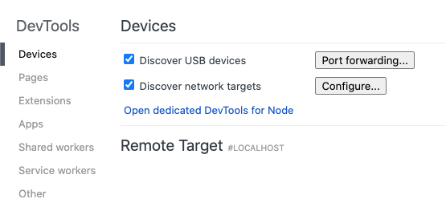
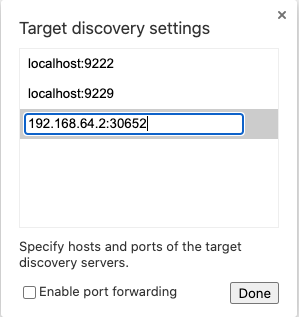
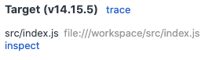
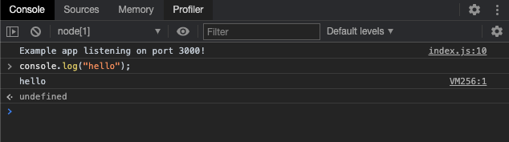

# Skaffold with Paketo Buildpacks

## How does Skaffold work?

[Skaffold](https://skaffold.dev/) executes as a command-line tool on your local
workstation. Running a `skaffold` command, like `skaffold run` will result in
your application being built and deployed into your Kubernetes cluster. Once
deployed, you can confirm that your application is running in your Kubernetes
cluster. Skaffold refers to this process as a "pipeline", and it expects to
find the definition of that pipeline in a `skaffold.yaml` file.

The pipeline executes by performing a number of stages in sequence. Pipelines
have quite a few stages, but the 2 primary ones are:
[Build](https://skaffold.dev/docs/pipeline-stages/builders/) and
[Deploy](https://skaffold.dev/docs/pipeline-stages/deployers/). By default a
pipeline will use a `Dockerfile` to build your application container image, and
then deploy that image using a Kubernetes manifest found in `k8s/*.yaml`. An
example of such a pipeline `skaffold.yaml` file might look like the following:

```yaml
apiVersion: skaffold/v2beta12
kind: Config
build:
  artifacts:
  - image: example-basic
```

This pipeline declares that an image called `example-basic` will be built with
the implied `Dockerfile` located in the same directory as this pipeline file.
By default this image will be built with the local Docker daemon, but Skaffold
does support remote build processes. Once the image is built, Skaffold will
find any Kubernetes manifests located in the `k8s` directory. An example of
such a manifest might look like the following:

```yaml
apiVersion: v1
kind: Pod
metadata:
  name: example-basic
spec:
  containers:
  - name: example-basic
    image: example-basic
```

In this case, we are deploying the `example-basic` image as a Pod to our
Kubernetes cluster. Once the Pod is deployed, you can confirm with `kubectl get
pod example-basic` that the application is up and running.

Executing `skaffold run` for this application might look like the following:

```
$ skaffold run
Generating tags...
 - example-basic -> example-basic:540176d
Checking cache...
 - example-basic: Not found. Building
Found [minikube] context, using local docker daemon.
Building [example-basic]...
Sending build context to Docker daemon  3.072kB
Step 1/8 : FROM golang:1.15 as builder
 ---> 05499cedca62
Step 2/8 : COPY main.go .
 ---> 12522855dcb9
Step 3/8 : ARG SKAFFOLD_GO_GCFLAGS
 ---> Running in e682fdde575f
 ---> 914bb1a7873d
Step 4/8 : RUN go build -gcflags="${SKAFFOLD_GO_GCFLAGS}" -o /app main.go
 ---> Running in b0660ba92950
 ---> a5cb3e1fbe1c
Step 5/8 : FROM alpine:3
 ---> 28f6e2705743
Step 6/8 : ENV GOTRACEBACK=single
 ---> Running in 3bd38b184251
 ---> 112abd187d6f
Step 7/8 : CMD ["./app"]
 ---> Running in 7017e8e5697f
 ---> e04dba39f650
Step 8/8 : COPY --from=builder /app .
 ---> 5b3233bf8cd9
Successfully built 5b3233bf8cd9
Successfully tagged example-basic:540176d
Tags used in deployment:
 - example-basic -> example-basic:5b3233bf8cd95c4edf74e0455b70c06bc804c526923156078d4417efe866c50c
Starting deploy...
 - pod/example-basic created
Waiting for deployments to stabilize...
Deployments stabilized in 74.095972ms
You can also run [skaffold run --tail] to get the logs
```

You can find the code for this in [`examples/basic/dockerfile`](examples/basic/dockerfile).

## Using buildpacks

Skaffold doesn't just support building using a `Dockerfile`. There is currently
[beta support](https://skaffold.dev/docs/pipeline-stages/builders/buildpacks/)
for building source code into container images using [Cloud Native
Buildpacks](https://buildpacks.io/). Taking the previous example, we can modify
our pipeline to use the buildpack feature:

```yaml
apiVersion: skaffold/v2beta12
kind: Config
build:
  artifacts:
  - image: example-basic
    buildpacks:
      builder: index.docker.io/paketobuildpacks/builder:base
```

Now, when we run `skaffold run`, our application container image will be built
using the CNB lifecycle and Paketo builder.

```
$ skaffold run
Generating tags...
 - example-basic -> example-basic:540176d-dirty
Checking cache...
 - example-basic: Not found. Building
Found [minikube] context, using local docker daemon.
Building [example-basic]...
base: Pulling from paketobuildpacks/builder
d519e2592276: Pull complete
d22d2dfcfa9c: Pull complete
b3afe92c540b: Pull complete
...
Digest: sha256:d9209fcc8d70314b66b3e67b0a64a09f95a69219fd24371c8f1cd78a8044e769
Status: Downloaded newer image for paketobuildpacks/builder:base
base-cnb: Pulling from paketobuildpacks/run
d519e2592276: Already exists
d22d2dfcfa9c: Already exists
b3afe92c540b: Already exists
e6b49eae9e5b: Pull complete
23204e8f2e10: Pull complete
1f233ac18c1d: Pull complete
Digest: sha256:d7ce225d0061cc80333a06577faeed266efe9e74c578470a948517b668b5630c
Status: Downloaded newer image for paketobuildpacks/run:base-cnb
0.10.2: Pulling from buildpacksio/lifecycle
5749e56bea71: Pull complete
ab6640ec168a: Pull complete
Digest: sha256:c3a070ed0eaf8776b66f9f7c285469edccf5299b3283c453dd45699d58d78003
Status: Downloaded newer image for buildpacksio/lifecycle:0.10.2
===> DETECTING
[detector] 2 of 5 buildpacks participating
[detector] paketo-buildpacks/go-dist  0.3.0
[detector] paketo-buildpacks/go-build 0.2.2
===> ANALYZING
[analyzer] Previous image with name "example-basic:latest" not found
===> RESTORING
===> BUILDING
[builder] Paketo Go Distribution Buildpack 0.3.0
[builder]   Resolving Go version
[builder]     Candidate version sources (in priority order):
[builder]       <unknown> -> ""
[builder]
[builder]     Selected Go version (using <unknown>): 1.15.8
[builder]
[builder]   Executing build process
[builder]     Installing Go 1.15.8
[builder]       Completed in 11.132s
[builder]
[builder] Paketo Go Build Buildpack 0.2.2
[builder]   Executing build process
[builder]     Running 'go build -o /layers/paketo-buildpacks_go-build/targets/bin -buildmode pie .'
[builder]       Completed in 6.749s
[builder]
[builder]   Assigning launch processes
[builder]     web: /layers/paketo-buildpacks_go-build/targets/bin/workspace
===> EXPORTING
[exporter] Adding layer 'paketo-buildpacks/go-build:targets'
[exporter] Adding 1/1 app layer(s)
[exporter] Adding layer 'launcher'
[exporter] Adding layer 'config'
[exporter] Adding layer 'process-types'
[exporter] Adding label 'io.buildpacks.lifecycle.metadata'
[exporter] Adding label 'io.buildpacks.build.metadata'
[exporter] Adding label 'io.buildpacks.project.metadata'
[exporter] Setting default process type 'web'
[exporter] *** Images (d744bf1422d3):
[exporter]       example-basic:latest
[exporter] Adding cache layer 'paketo-buildpacks/go-dist:go'
[exporter] Adding cache layer 'paketo-buildpacks/go-build:gocache'
Tags used in deployment:
 - example-basic -> example-basic:d744bf1422d31c703fe8e56a11bdd293580af3f669fe976fc3fa7d75df74d88d
Starting deploy...
 - pod/example-basic created
Waiting for deployments to stabilize...
Deployments stabilized in 126.091811ms
You can also run [skaffold run --tail] to get the logs
```

You can find the code for this in [`examples/basic/paketo`](examples/basic/paketo).

In Skaffold, buildpacks suffer from the same performance issues we outlined in
the [Tilt exploration](/0002-tilt/README.md#what-is-the-inner-loop-like). These
issues are inherent to the buildpack lifecycle and would need to be addressed
upstream.

## `skaffold dev`

Beyond the simple `skaffold run` command, Skaffold supports a ["development
loop" workflow](https://skaffold.dev/docs/workflows/dev/) that can be invoked
using the `skaffold dev` command. When this command is invoked, Skaffold will
rebuild and redeploy your application every time there are changes to the
source code.

In addition to the previously discussed Build and Deploy stages, `skaffold dev`
introduces a new [File
Sync](https://skaffold.dev/docs/pipeline-stages/filesync/) stage that allows
for faster development loop cycles by allowing users to "live update" their
running application container using a mechanism that is similar to what was
[previously outlined](/0002-tilt/README.md#the-live-update-paradigm) in the
Tilt Exploration.

When you first run `skaffold dev`, Skaffold will run the Build and Deploy
stages as normal, resulting in a running app on your Kubernetes cluster. Then,
on subsequent changes to your source code it will sync those files to the
running container and restart the process, skipping the Build and Deploy stages
entirely.

### Using File Sync with buildpacks

The File Sync feature is supported by the [Google
buildpacks](https://github.com/GoogleCloudPlatform/buildpacks). When Skaffold
runs, it provides the buildpack with a `GOOGLE_DEVMODE` environment variable.
The buildpacks modify their behavior based on the presence of this variable.

First, they emit a bill-of-materials that includes some metadata telling
Skaffold what files it should watch for changes and sync into the running
container.

Second, they include some build-time dependencies (like the Go
distribution) as launch layers to that they are available to rebuild go
applications while running.

Finally, they overwrite the start command to run a special script. This script
will run a process that watches the filesystem for changes. When files change,
it will rebuild the app and then restart the app process.

We can see this in operation if we run `skaffold dev` on an example that uses
the Google buildpacks. The following example builds a Go application that logs
"Hello world!" to `stdout` once every second.

```
$ skaffold dev
Listing files to watch...
 - example-file-sync
Generating tags...
 - example-file-sync -> example-file-sync:084abfe-dirty
Checking cache...
 - example-file-sync: Not found. Building
Found [minikube] context, using local docker daemon.
Building [example-file-sync]...
v1: Pulling from buildpacks/builder
Digest: sha256:20197a42da6a3d326e874a90c1a7178e37c5d0645ce8e9cf654c1d8984293787
Status: Image is up to date for gcr.io/buildpacks/builder:v1
v1: Pulling from buildpacks/gcp/run
Digest: sha256:784f4ff2f5ffa20be59668b08e979874f335e9c81704e73c495af8b245d4e9cf
Status: Image is up to date for gcr.io/buildpacks/gcp/run:v1
0.9.3: Pulling from buildpacksio/lifecycle
Digest: sha256:bc253af2edf1577717618cb3a95f0f16bb18fc9e804efbcc1b85f657d931a757
Status: Image is up to date for buildpacksio/lifecycle:0.9.3
===> DETECTING
[detector] 4 of 6 buildpacks participating
[detector] google.go.runtime  0.9.1
[detector] google.go.gopath   0.9.0
[detector] google.go.build    0.9.0
[detector] google.utils.label 0.0.1
===> ANALYZING
[analyzer] Restoring metadata for "google.go.runtime:go" from app image
[analyzer] Restoring metadata for "google.go.build:bin" from app image
[analyzer] Restoring metadata for "google.go.build:devmode_scripts" from app image
[analyzer] Restoring metadata for "google.go.build:watchexec" from app image
===> RESTORING
[restorer] Restoring data for "google.go.runtime:go" from cache
[restorer] Restoring data for "google.go.build:watchexec" from cache
===> BUILDING
[builder] === Go - Runtime (google.go.runtime@0.9.1) ===
[builder] --------------------------------------------------------------------------------
[builder] Running "curl --fail --show-error --silent --location https://golang.org/dl/?mode=json"
[builder] Done "curl --fail --show-error --silent --location https://golang...." (216.214195ms)
[builder] Using latest runtime version: 1.15.8
[builder] === Go - Gopath (google.go.gopath@0.9.0) ===
[builder] --------------------------------------------------------------------------------
[builder] Running "go get -d (GOPATH=/layers/google.go.gopath/gopath GO111MODULE=off)"
[builder] Done "go get -d (GOPATH=/layers/google.go.gopath/gopath GO111MODUL..." (242.114919ms)
[builder] === Go - Build (google.go.build@0.9.0) ===
[builder] --------------------------------------------------------------------------------
[builder] Running "go list -f {{if eq .Name \"main\"}}{{.Dir}}{{end}} ./..."
[builder] /workspace
[builder] Done "go list -f {{if eq .Name \"main\"}}{{.Dir}}{{end}} ./..." (116.977577ms)
[builder] --------------------------------------------------------------------------------
[builder] Running "go build -o /layers/google.go.build/bin/main ./. (GOCACHE=/layers/google.go.build/gocache)"
[builder] Done "go build -o /layers/google.go.build/bin/main ./. (GOCACHE=/l..." (512.913556ms)
[builder] === Utils - Label Image (google.utils.label@0.0.1) ===
===> EXPORTING
[exporter] Reusing layer 'google.go.runtime:go'
[exporter] Reusing layer 'google.go.build:bin'
[exporter] Reusing layer 'google.go.build:devmode_scripts'
[exporter] Adding layer 'google.go.build:gocache'
[exporter] Reusing layer 'google.go.build:watchexec'
[exporter] Adding 1/1 app layer(s)
[exporter] Reusing layer 'launcher'
[exporter] Reusing layer 'config'
[exporter] Reusing layer 'process-types'
[exporter] Adding label 'io.buildpacks.lifecycle.metadata'
[exporter] Adding label 'io.buildpacks.build.metadata'
[exporter] Adding label 'io.buildpacks.project.metadata'
[exporter] Setting default process type 'web'
[exporter] *** Images (5110be3ac725):
[exporter]       example-file-sync:latest
[exporter] Reusing cache layer 'google.go.runtime:go'
[exporter] Reusing cache layer 'google.go.build:watchexec'
Tags used in deployment:
 - example-file-sync -> example-file-sync:5110be3ac7252e4565247002c2a22c39066f4a0aa4353436188db463ae9b7a29
Starting deploy...
 - pod/example-file-sync created
Waiting for deployments to stabilize...
Deployments stabilized in 112.538089ms
Press Ctrl+C to exit
Watching for changes...
[example-file-sync] Hello world!
[example-file-sync] Hello world!
[example-file-sync] Hello world!
```

Then, when we modify the `main.go` to print "Hello moon!", it syncs that file
and runs the build and restart process from inside of the running container:

```
[example-file-sync] Hello world!
[example-file-sync] Hello world!
[example-file-sync] Hello world!
Syncing 1 files for example-file-sync:5110be3ac7252e4565247002c2a22c39066f4a0aa4353436188db463ae9b7a29
Watching for changes...
[example-file-sync] Hello world!
[example-file-sync] Hello moon!
[example-file-sync] Hello moon!
[example-file-sync] Hello moon!
```

You can find the code for this in [`examples/file-sync`](examples/file-sync).

We can take a look at the metadata that the Google buildpacks attached to the
image under the bill of materials by running the following:

```
$ pack inspect-image example-file-sync --bom
{
  "remote": null,
  "local": [
    {
      "name": "",
      "metadata": {
        "devmode.sync": [
          {
            "dest": "/workspace",
            "src": "**/*.go"
          }
        ]
      },
      "buildpacks": {
        "id": "google.go.build",
        "version": "0.9.0"
      }
    }
  ]
}
```

You can see that the buildpack is telling Skaffold to watch for any `*.go`
files and to sync to the `/workspace` in the running container when they
change.

Further inspection of that same image shows that it is using a start command
called `watch_and_run.sh`:

```
$ pack inspect-image example-file-sync
Inspecting image: example-file-sync

REMOTE:
(not present)

LOCAL:

Stack: google

Base Image:
  Reference: e5f7e62bf8a96d60f65f04a9d7caafb532d69c0ea955a276a0b476b0500b75ee
  Top Layer: sha256:64b8c91fa7e24f21fd7edb153d1f820055b4ae1cd542a1554501617bb0547df9

Run Images:
  gcr.io/buildpacks/gcp/run:v1

Buildpacks:
  ID                        VERSION
  google.go.runtime         0.9.1
  google.go.gopath          0.9.0
  google.go.build           0.9.0
  google.utils.label        0.0.1

Processes:
  TYPE                 SHELL        COMMAND        ARGS
  web (default)                     watch_and_run.sh
```

We can take a look at that script to see what is happening there:

```
$ docker run -it --entrypoint launcher example-file-sync bash
cnb@cb0ad6d9b096:/workspace$ find / -name watch_and_run.sh
/layers/google.go.build/devmode_scripts/bin/watch_and_run.sh
cnb@cb0ad6d9b096:/workspace$ cat /layers/google.go.build/devmode_scripts/bin/watch_and_run.sh
#!/bin/sh
watchexec -r -e go /layers/google.go.build/devmode_scripts/bin/build_and_run.sh
```

So, the start command uses a tool called
[`watchexec`](https://github.com/watchexec/watchexec) to watch for files with
the extension `go` and then run another script called `build_and_run.sh` when
they change.

Let's take a look at the `build_and_run.sh` script:

```
$ docker run -it --entrypoint launcher example-file-sync bash
cnb@d03924735435:/workspace$ cat /layers/google.go.build/devmode_scripts/bin/build_and_run.sh
#!/bin/sh
go build -o /layers/google.go.build/bin/main ./. && /layers/google.go.build/bin/main
```

The `build_and_run.sh` script runs the `go build` process creating a binary
called `main` and then runs the `main` executable.

This entire process is similar to what we outlined as a [possible path
forward](https://github.com/ryanmoran/explorations/tree/main/0002-tilt#how-could-buildpacks-get-involved-1)
in the Tilt exploration. Any implementation should push for a set of features
supported upstream by the buildpack spec such that we could leverage those
features in a platform agnostic way. Today, simply recreating what Google has
implemented would only allow us to integrate with Skaffold, limiting the reach
of the feature.

#### Stack Limitations

The File Sync feature operates by `exec`-ing a `tar` command that is given a
tarball with the contents of the files to be copied into the running container.
This means that the existing File Sync feature can only operate on stacks that
include the `tar` package. Currently, `tar` is not included in the Tiny run
image. Instead of adding `tar` to the Tiny stack, it may be better to have the
buildpack lifecycle base the image off of the build image, thus ensuring all of
the same dependencies that were available during the build process were also
available during this File Sync stage.

## `skaffold debug`

Skaffold has support for remote debugging the containers that it deploys. You
can run a `skaffold debug` command on any Skaffold pipeline and that pipeline
will run in "debug mode". As it exists today, Skaffold does all of the work to
enable this.

Let's explore this via an example. We are going to run `skaffold debug` using
the [`examples/debug`](examples/debug) codebase. This codebase uses a simple
Node.js server to respond to requests with "Hello world!"

```
skaffold debug
Listing files to watch...
 - example-debug
Generating tags...
 - example-debug -> example-debug:0918d37-dirty
Checking cache...
 - example-debug: Not found. Building
Found [minikube] context, using local docker daemon.
Building [example-debug]...
base: Pulling from paketobuildpacks/builder
...
Digest: sha256:45a889434ed64017eb18bfbf30c38db1b52566e0d341eb85d6c41fbed84b664f
Status: Downloaded newer image for paketobuildpacks/builder:base
base-cnb: Pulling from paketobuildpacks/run
...
Digest: sha256:e89f3ba15ab6ef4d43d1521c9238b5c74efcf78c1f52470bfec04bc2a025528b
Status: Downloaded newer image for paketobuildpacks/run:base-cnb
0.10.2: Pulling from buildpacksio/lifecycle
Digest: sha256:c3a070ed0eaf8776b66f9f7c285469edccf5299b3283c453dd45699d58d78003
Status: Image is up to date for buildpacksio/lifecycle:0.10.2
===> DETECTING
[detector] 3 of 6 buildpacks participating
[detector] paketo-buildpacks/node-engine 0.1.9
[detector] paketo-buildpacks/npm-install 0.2.6
[detector] paketo-buildpacks/npm-start   0.0.4
===> ANALYZING
[analyzer] Previous image with name "example-debug:latest" not found
===> RESTORING
===> BUILDING
[builder] Paketo Node Engine Buildpack 0.1.9
[builder]   Resolving Node Engine version
[builder]     Candidate version sources (in priority order):
[builder]                 -> ""
[builder]       <unknown> -> "*"
[builder]
[builder]     Selected Node Engine version (using ): 14.15.5
[builder]
[builder]   Executing build process
[builder]     Installing Node Engine 14.15.5
[builder]       Completed in 4.237s
[builder]
[builder]   Configuring build environment
[builder]     NODE_ENV     -> "production"
[builder]     NODE_HOME    -> "/layers/paketo-buildpacks_node-engine/node"
[builder]     NODE_VERBOSE -> "false"
[builder]
[builder]   Configuring launch environment
[builder]     NODE_ENV     -> "production"
[builder]     NODE_HOME    -> "/layers/paketo-buildpacks_node-engine/node"
[builder]     NODE_VERBOSE -> "false"
[builder]
[builder]     Writing profile.d/0_memory_available.sh
[builder]       Calculates available memory based on container limits at launch time.
[builder]       Made available in the MEMORY_AVAILABLE environment variable.
[builder]
[builder] Paketo NPM Install Buildpack 0.2.6
[builder]   Resolving installation process
[builder]     Process inputs:
[builder]       node_modules      -> "Not found"
[builder]       npm-cache         -> "Not found"
[builder]       package-lock.json -> "Not found"
[builder]
[builder]     Selected NPM build process: 'npm install'
[builder]
[builder]   Executing build process
[builder]     Running 'npm install --unsafe-perm --cache /layers/paketo-buildpacks_npm-install/npm-cache'
[builder]       Completed in 5.708s
[builder]
[builder]   Configuring launch environment
[builder]     NPM_CONFIG_LOGLEVEL -> "error"
[builder]
[builder]   Configuring environment shared by build and launch
[builder]     PATH -> "$PATH:/layers/paketo-buildpacks_npm-install/modules/node_modules/.bin"
[builder]
[builder]
[builder] Paketo NPM Start Buildpack 0.0.4
[builder]   Assigning launch processes
[builder]     web: node src/index.js
===> EXPORTING
[exporter] Adding layer 'paketo-buildpacks/node-engine:node'
[exporter] Adding layer 'paketo-buildpacks/npm-install:modules'
[exporter] Adding layer 'paketo-buildpacks/npm-install:npm-cache'
[exporter] Adding 1/1 app layer(s)
[exporter] Adding layer 'launcher'
[exporter] Adding layer 'config'
[exporter] Adding layer 'process-types'
[exporter] Adding label 'io.buildpacks.lifecycle.metadata'
[exporter] Adding label 'io.buildpacks.build.metadata'
[exporter] Adding label 'io.buildpacks.project.metadata'
[exporter] Setting default process type 'web'
[exporter] *** Images (74a07215c933):
[exporter]       example-debug:latest
[exporter] Adding cache layer 'paketo-buildpacks/node-engine:node'
[exporter] Adding cache layer 'paketo-buildpacks/npm-install:modules'
[exporter] Adding cache layer 'paketo-buildpacks/npm-install:npm-cache'
Tags used in deployment:
 - example-debug -> example-debug:74a07215c933f50c8c87f4012dde5da4b4ae257c66fac15ae5564b6618061167
Starting deploy...
 - service/web created
 - deployment.apps/web created
Waiting for deployments to stabilize...
 - deployment/web is ready.
Deployments stabilized in 4.811 seconds
Press Ctrl+C to exit
Not watching for changes...
[install-nodejs-debug-support] Installing runtime debugging support files in /dbg
[install-nodejs-debug-support] Installation complete
[web] Debugger listening on ws://0.0.0.0:9229/6d1e170a-35d7-477e-8738-20842e4d10d1
[web] For help, see: https://nodejs.org/en/docs/inspector
[web] Example app listening on port 3000!
```

We can see here that the output looks like a normal build process using the
Paketo Node.js buildpack. We can see that our application is up and running on
port 3000.

Our example codebase included a Kubernetes manifest that declared that a
LoadBalancer should attach 2 ports to the Deployment under a Service named
`web`. One for http and another for our debug process.

```yaml
apiVersion: v1
kind: Service
metadata:
  name: web
spec:
  ports:
  - port: 3000
    name: http
  - port: 9229
    name: debug
  type: LoadBalancer
  selector:
    app: web
```

Let's find out how that LoadBalancer is bound to our host machine.

```
$ minikube service web
|-----------|------|-------------|---------------------------|
| NAMESPACE | NAME | TARGET PORT |            URL            |
|-----------|------|-------------|---------------------------|
| default   | web  | http/3000   | http://192.168.64.2:30262 |
|           |      | debug/9229  | http://192.168.64.2:30652 |
|-----------|------|-------------|---------------------------|
```

And when we make a request to that url, we can see our "Hello world!" response.

```
curl -vvv http://192.168.64.2:30262/hello
*   Trying 192.168.64.2...
* TCP_NODELAY set
* Connected to 192.168.64.2 (192.168.64.2) port 32266 (#0)
> GET /hello HTTP/1.1
> Host: 192.168.64.2:32266
> User-Agent: curl/7.64.1
> Accept: */*
>
< HTTP/1.1 200 OK
< X-Powered-By: Express
< Content-Type: text/html; charset=utf-8
< Content-Length: 12
< ETag: W/"c-00hq6RNueFa8QiEjhep5cJRHWAI"
< Date: Wed, 24 Feb 2021 18:24:47 GMT
< Connection: keep-alive
< Keep-Alive: timeout=5
<
* Connection #0 to host 192.168.64.2 left intact
Hello world!
* Closing connection 0
```

There was also some output that mentioned debug ports above.

```
[install-nodejs-debug-support] Installing runtime debugging support files in /dbg
[install-nodejs-debug-support] Installation complete
[web] Debugger listening on ws://0.0.0.0:9229/6d1e170a-35d7-477e-8738-20842e4d10d1
[web] For help, see: https://nodejs.org/en/docs/inspector
```

Let's use the Chrome Inspector to connect to the remote debugger. First, we
will open Chrome and navigate to `chrome://inspect`.



We'll click on the "Configure..." button and add `192.168.64.2:30652` as a
target.



Once we have configured the target, we can jump into a
[REPL](https://en.wikipedia.org/wiki/Read%E2%80%93eval%E2%80%93print_loop) that
executes inside of the running container.



Let's do something simple like printing "hello" to `stdout`.



Going back to our application logs, we can see that "hello" was printed to
`stdout`.

```
[web] Example app listening on port 3000!
[web] Debugger attached.
[web] hello
```

When `skaffold debug` is run, the buildpacks execute as normal and
produce an image. Skaffold then modifies the Pod start command such that it
invokes the right kind of debug tooling. For example, Skaffold will modify a Go
image by rewriting the Pod start command to execute `dlv` and bind it to a
port. Additionally, it includes the `dlv` command via a volume mount that it
includes in the Pod spec.

## Links of Interest
[Quick Start](https://skaffold.dev/docs/quickstart/)
[GitHub Repo](https://github.com/GoogleContainerTools/skaffold)
